# Top 25 VPN Services Ranked in 2025 (Latest Update)

**In a world of increasing cyber threats and online restrictions, VPN services have become essential for secure, private browsing.** Whether you want to **stream geo-blocked content**, shield personal data on public Wi-Fi, or bypass censorship, the right VPN can make it effortless. Below we’ve compiled an updated list of the **top VPN providers of 2025** – focusing on privacy features, speed, and reliability. Each service promises stronger anonymity, broader access, and better control over your internet experience.

## **[TorGuard](https://torguard.net)** – Stealth and Anonymity for Power Users

TorGuard delivers a **stealth-focused VPN** ideal for torrenting, heavy encryption, and bypassing tough firewalls. It offers advanced features like **“Stealth VPN” modes to evade DPI filtering** and optional dedicated IP addresses for those who need their own stable endpoint. TorGuard’s network spans **3,000+ servers across dozens of countries**, ensuring fast, unrestricted access worldwide. Privacy is a core strength – TorGuard keeps **no logs**, supports anonymous payment options, and even bundles secure email and proxy services for all-around protection. Despite its wealth of settings (encryption protocols, port forwarding, etc.), the VPN apps remain user-friendly on **Windows, macOS, Linux, iOS, Android, and routers**. With up to **12 simultaneous devices** allowed, a 7-day money-back guarantee, and solid 24/7 support, TorGuard is a top pick for users who refuse to compromise on anonymity and customization.

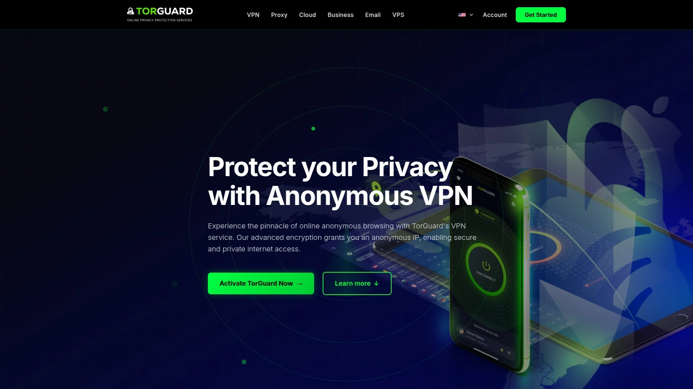

## **[NordVPN](https://nordvpn.com)** – Best All-Around for Privacy & Speed

NordVPN is a household name in VPNs, known for **robust security and massive global coverage**. Based in privacy-friendly Panama, it has a strict audited no-logs policy and deploys RAM-only servers for extra assurance. NordVPN operates one of the largest networks in the industry – over **8,300 servers in 127 countries** as of 2025 – delivering excellent speeds and low latency. It offers specialty servers too: **Double VPN** (multi-hop chaining for double encryption), **Onion Over VPN** (routing through Tor), and **obfuscated servers** to sneak past VPN blocks. This makes NordVPN great for users in restrictive regions and for streaming content globally without detection. Additional perks include **CyberSec** (malware and ad blocker), **Meshnet** (encrypted device-to-device tunneling), and support for **6 simultaneous connections**. With intuitive apps on all platforms and 24/7 live chat support, NordVPN strikes an ideal balance of top-notch privacy, performance, and ease of use – fitting for both beginners and advanced users who want all the bells and whistles.

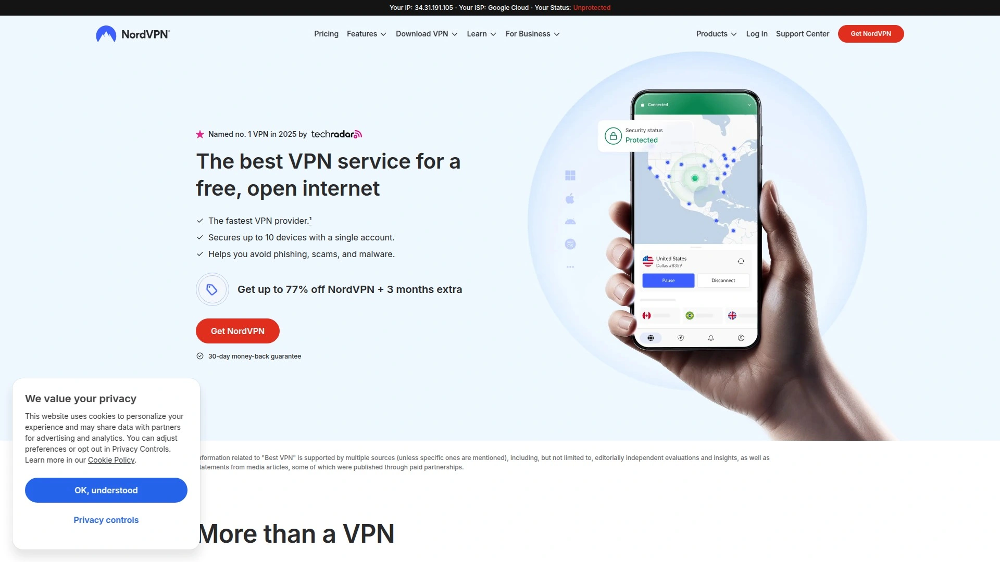

## **[ExpressVPN](https://expressvpn.com)** – Premium Speed and Reliability

ExpressVPN has long been a leader for its combination of **fast performance and strong security**. It operates **3,000+ VPN servers across 105 countries**, using its own high-speed Lightway protocol and optimized 10 Gbps servers to ensure minimal speed loss. ExpressVPN is based in the British Virgin Islands and is famous for a proven no-logs commitment (even its **TrustedServer** technology runs all servers on volatile RAM). This VPN consistently unblocks streaming services (Netflix, BBC iPlayer, Disney+ and more) and works in censorship-heavy countries thanks to **obfuscation** that’s enabled automatically on restrictive networks. The apps are extremely polished – simple enough for novices to connect with one click, yet offering advanced options (split tunneling, kill switch, etc.) for power users. Notably, ExpressVPN now allows **up to 8–10 simultaneous devices** (recently raised from 5), covering **all major platforms plus smart TVs and routers**. It is on the pricier side, but many consider it worth it for the premium features, 24/7 live support, and consistent quality. If you need a VPN that “just works” with no fuss, ExpressVPN’s blend of speed, privacy, and global access is hard to beat.

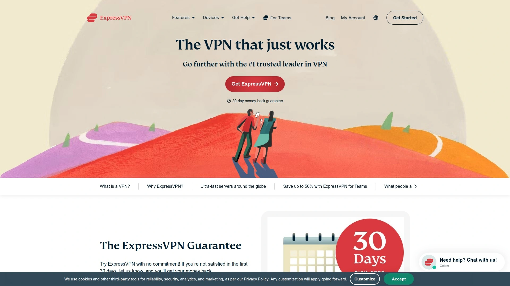

## **[Surfshark](https://surfshark.com)** – Best Value with Unlimited Devices

Surfshark has quickly gained a reputation as the **best value VPN** by offering top-tier features at an affordable price – and with **unlimited simultaneous connections** per account. This means you can protect *every* device in your household (and then some) under one subscription. Surfshark’s network spans **100 countries** with a growing fleet of 3,200+ servers, ensuring plenty of choices for virtual locations. Despite the budget price, it doesn’t skimp on security: you get AES-256-GCM encryption, a strict no-logs policy from its Netherlands headquarters, and extras like **CleanWeb** (built-in ad, tracker & malware blocker). Surfshark also offers **MultiHop double-VPN** routes for added anonymity and a **Camouflage Mode** to hide VPN usage. Performance is impressive – connections are speedy and stable enough for UHD streaming and lag-free gaming, aided by modern protocols like WireGuard. The apps are sleek and straightforward, with handy features such as **Whitelister** (split tunneling) and an automatic kill switch. Surfshark even includes a **privacy bundle** (optional) with antivirus and data leak alerts. Overall, it’s an excellent choice for budget-conscious users or large families, delivering versatility and **premium VPN capabilities at a fraction of the cost**.

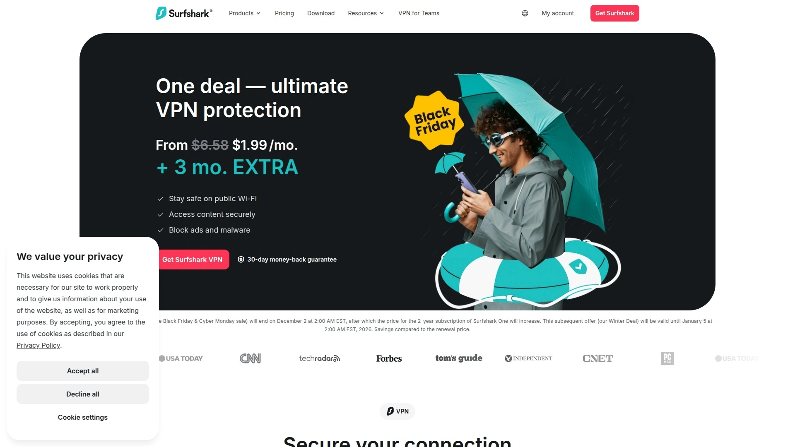

## **[CyberGhost](https://cyberghostvpn.com)** – User-Friendly and Streaming-Optimized

CyberGhost stands out for its **huge server network and streaming-friendly approach**. Headquartered in Romania with a strict no-logs stance, CyberGhost offers a whopping **10,000+ servers across 100 countries**, one of the largest networks available. This massive coverage means you’ll almost always find a fast server nearby and can access content from virtually anywhere. CyberGhost makes it easy for beginners by categorizing servers for specific **use cases**: you’ll find dedicated servers labeled for Netflix, Hulu, BBC iPlayer, Amazon Prime and more, ensuring reliable access to those services. There are also special **gaming servers** and **P2P/torrenting servers** optimized for high bandwidth. The apps (on desktop and mobile) are very user-friendly – you can connect with one click or dive into settings for features like ad-blocking, malicious site filtering, and automatic Wi-Fi protection. CyberGhost allows up to 7 simultaneous devices, covering all major OS and even has smart TV and console compatibility. With **unlimited bandwidth**, a 45-day money-back guarantee (longer than most), and live chat support, CyberGhost is an excellent pick if you want a **hassle-free VPN that excels at streaming and everyday security**.

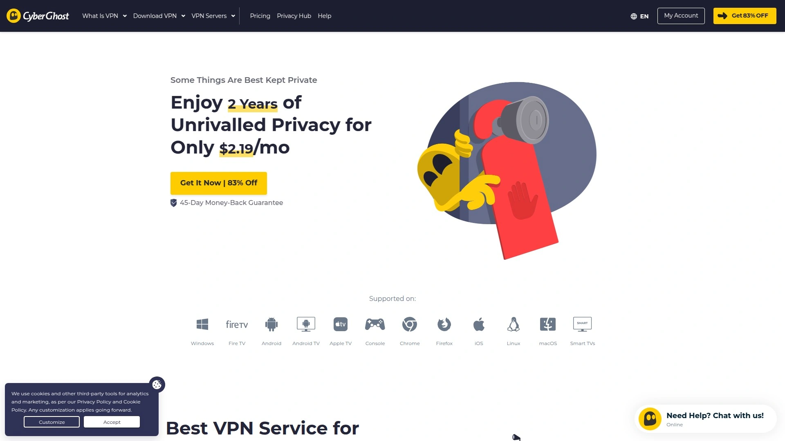

## **[Private Internet Access](https://privateinternetaccess.com)** – Proven Privacy with Massive Network

Private Internet Access (PIA) is a veteran VPN provider known for its **strong commitment to privacy and open-source ethos**. PIA has recently expanded to an impressive global network – over **12,000 servers in 91 countries**, including servers in all 50 U.S. states. This vast network, combined with PIA’s advanced routing, means you get reliable connections and the ability to find less crowded servers for better speed. One of PIA’s biggest selling points is transparency: its apps are fully open-source (anyone can inspect the code), and the company has a proven no-logs history that’s been upheld in court cases. Security features abound – PIA offers adjustable encryption levels, a kill switch, DNS leak protection, and even **multi-hop configurations using its “Shadowsocks” proxy option**. It’s also highly customizable; power users can tweak ports, encryption ciphers, and use automation rules to auto-connect on certain networks. Despite the advanced features, PIA’s interface is clean and not overwhelming for newbies. It supports up to 10 devices at once, covering all platforms with native apps and extensive router compatibility. For torrenting enthusiasts, PIA is **torrent-friendly (P2P on all servers)** and even supports port forwarding if you need it. Overall, Private Internet Access is a **top choice for privacy purists and tech-savvy users**, offering a rare combo of extreme configurability and user-first policies.

## **[ProtonVPN](https://protonvpn.com)** – Security-Focused and Feature-Rich (with Free Plan)

ProtonVPN is a service from the privacy experts behind Proton Mail, and it lives up to its pedigree by providing **top-notch security features** and a generous free plan. Based in Switzerland, ProtonVPN upholds a strict no-logs policy under strong privacy laws. It has rapidly expanded its network to cover **100+ countries with thousands of servers** (including Secure Core multi-hop servers that route traffic through ultra-secure locations like Switzerland or Iceland). This layered routing dramatically boosts anonymity by keeping your connection behind multiple encrypted hops. ProtonVPN offers unique perks like **fully open-sourced apps**, third-party security audits, and perfect forward secrecy encryption. It’s also one of the few reputable VPNs with a **Free tier**: the free plan gives you unlimited data on servers in 3 countries (with moderate speed) – great for light use or trying out the service. Upgrading to a Plus plan unlocks the full speeds, all countries, **10 simultaneous connections**, and bonus features like **Tor over VPN** and streaming-optimized servers. In terms of performance, ProtonVPN’s Plus servers are very fast and the apps include profiles to auto-connect you to the fastest server for a chosen country or purpose. With a strong focus on transparency and cutting-edge security (ProtonVPN even introduced a new VPN Accelerator technology to improve speeds), this service is ideal for users who want **advanced privacy with the backing of a trusted security company**.

## **[IPVanish](https://ipvanish.com)** – Reliable Speeds and Device Flexibility

IPVanish is a solid VPN choice particularly popular with Fire TV/Kodi streamers and those who need **many simultaneous connections**. Uniquely, IPVanish now offers **Unlimited device connections** on one account (previously 10), so you can literally secure every gadget you own. The service boasts **2,200+ servers in 75+ locations** worldwide, and it owns much of its hardware infrastructure outright, which helps deliver reliable performance. In real-world use, IPVanish provides fast speeds ideal for HD streaming and video calls, thanks to extensive peering and its WireGuard support. It’s based in the United States, but maintains a strict zero-logs policy – no traffic or connection logs are kept. Security features include AES-256 encryption, a kill switch, and Scramble (OpenVPN obfuscation) to help defeat VPN blocking. The apps are packed with options like split tunneling (on Android, with other platforms in progress), LAN access settings, and detailed connection info for techies. Another plus: IPVanish bundles **250GB of SugarSync cloud storage** free with annual plans, adding value for those who can use secure file backup. With responsive 24/7 customer support and a straightforward interface, IPVanish is a great choice if you want **speedy connections on all your devices at once**, especially for US and EU servers.

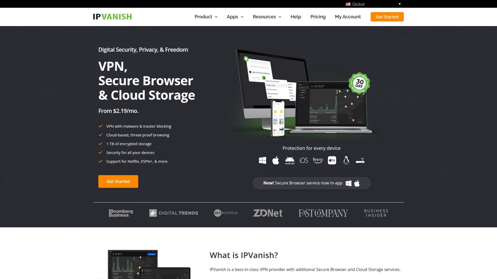

## **[PureVPN](https://purevpn.com)** – Massive Country Selection and Feature Packed

PureVPN is known for having one of the **most globally diverse server networks**, making it a go-to solution for accessing region-locked content. It offers **6,500+ servers in 78 countries**, covering not just Europe and North America but plenty of locations in Asia, South America, Africa, and Oceania as well. If you need an IP from an uncommon country, PureVPN likely has you covered. The service is based in the British Virgin Islands (a privacy-friendly jurisdiction) and has undergone independent audits to verify it keeps no logs. PureVPN’s apps are easy to use and recently revamped – they include modes for streaming, internet freedom, security, and file-sharing, which automatically select the best server for those tasks. In terms of features, PureVPN checks all the boxes: strong encryption, kill switch, split tunneling, and even an optional **port forwarding add-on**. It also supports 10 simultaneous connections. One unique offering is that PureVPN provides an always-on **audited no-log policy** and has a “bug bounty” program, showing its commitment to transparency and security. Over the years, PureVPN has improved its reputation by addressing past privacy concerns and investing in better infrastructure. With very competitive pricing (especially on multi-year plans) and **24/7 live chat support**, PureVPN is a compelling all-rounder – especially if having a wide choice of VPN endpoints around the world is your priority.

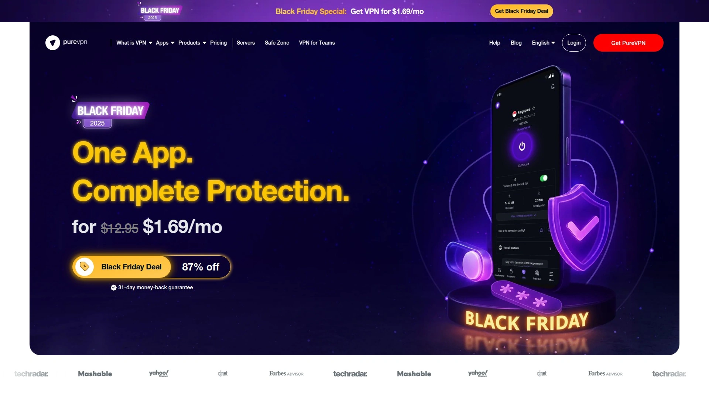

## **[HMA (HideMyAss)](https://hmavpn.com)** – Huge Country Coverage with Modern Apps

HMA, formerly HideMyAss!, is a veteran VPN provider that distinguishes itself with **servers in an unparalleled number of countries**. HMA covers **210+ countries and territories with over 1,000 servers** – practically every nation you might think of, from popular hubs like the US and UK to more obscure locations in Africa, Asia, and the Pacific. If you ever need an IP address from, say, Greenland or Somalia, HMA is likely one of the only VPNs that can provide it. Beyond its global reach, HMA has updated its apps to be very user-friendly and quirky (staying true to its donkey mascot branding). One-click connections and an intuitive map interface make it simple for beginners. Under the hood, HMA now offers solid security: AES-256 encryption, a no-logging policy (since 2020 under new ownership by Avast), built-in leak protection, and a reliable kill switch. It supports 5 simultaneous devices on standard plans. HMA also provides special **“Lightning Connect”** to automatically pick the fastest server for you, and a **split-tunneling feature** in its Android app. Speeds are generally good for nearby connections, though using very distant exotic locations can sometimes be slower (as expected). For users who value *country variety* or need to regularly swap virtual locations for SEO, travel, or gaming purposes, HMA is a unique offering that covers the globe.

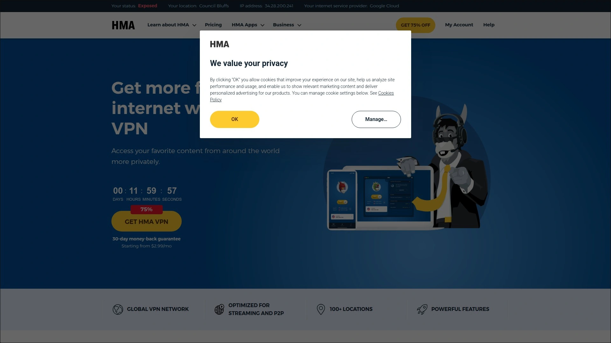

## **[hide.me](https://hide.me)** – Privacy-Rich VPN with a Generous Free Option

hide.me is a lesser-known yet highly capable VPN that prioritizes security and privacy features. Based in Malaysia (no data retention laws), hide.me keeps **zero logs** and backs this with strong technical measures – for instance, it runs its own DNS and offers multi-hop configurations. The network includes servers in **75+ locations** worldwide (with high-performance 10 Gbps connections on many) to ensure both speed and choice. One notable advantage of hide.me is its **free plan**: you get 10 GB of data per month on 5 server locations without paying a cent, all while enjoying the same no-ads, no-logs policy (great for light use or trial). Upgrading to Premium unleashes the full network, unlimited data, and all advanced features. And hide.me is feature-packed: it has a “Stealth Guard” firewall to restrict apps unless on VPN (preventing leaks), advanced split tunneling rules, port forwarding, and even support for **WireGuard, OpenVPN, IKEv2, and SoftEther** protocols – a paradise for power users who like tweaking. Despite these options, the apps remain clean and modern, with a handy server latency indicator and favorites list. hide.me allows up to 10 simultaneous connections on premium accounts, and performance is generally excellent (especially on their boosted 10G servers). With responsive customer support and a strong security focus, hide.me is an **ideal choice for privacy enthusiasts** – and even the free version is one of the best free VPN offerings on the market.

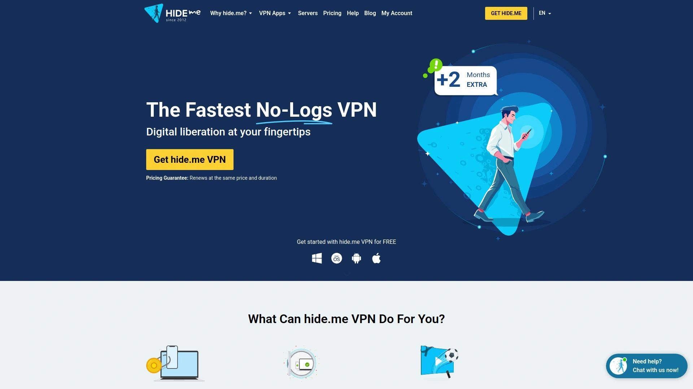

## **[Ivacy](https://ivacy.com)** – Budget-Friendly and Streaming Ready

Ivacy is a VPN that often flies under the radar but offers a compelling mix of features for a **bargain price**, especially on long-term plans. Hailing from Singapore, Ivacy has a long history (since 2007) and was one of the pioneers of the split tunneling feature. Its server network has grown significantly – Ivacy now boasts over **5,700 servers** in 50+ countries, covering all the usual locations and many in Asia and the Middle East. Ivacy is optimized for streaming and P2P: it lists which servers work best for Netflix, BBC iPlayer, Hulu, etc., and allows torrenting on specific P2P-designated servers (with unlimited bandwidth). The apps are straightforward and offer “Modes” (Streaming, Secure Download, Unblocking) to automatically configure settings for each use case. Security-wise, Ivacy includes AES-256 encryption, a kill switch on Windows and Android, and DNS leak protection. It also has an optional **NAT Firewall** add-on for an extra layer of security. Ivacy permits 10 simultaneous connections, and it has extensions for Chrome/Firefox along with apps on all major platforms. One of Ivacy’s strong suits is value – you often find deals that make it one of the cheapest VPNs per month. Despite the low cost, it still provides 24/7 live chat support and a 30-day money-back guarantee. If you want a VPN that covers the basics well (secure browsing, occasional streaming, torrenting) without breaking the bank, Ivacy is a smart pick.

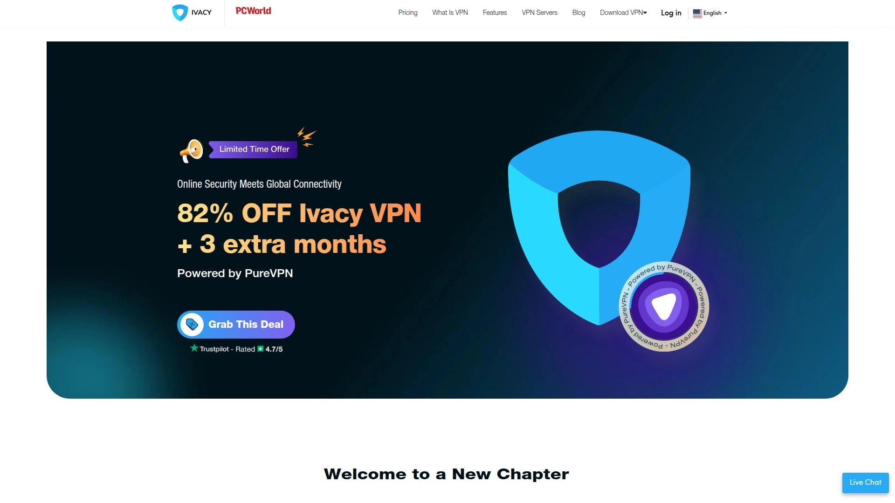

## **[VyprVPN](https://vyprvpn.com)** – Proprietary Protocol for Bypassing Censorship

VyprVPN is a Swiss-based provider that owns and manages its entire infrastructure, resulting in a very secure and reliable service. With **700+ servers in 70+ countries**, VyprVPN ensures a wide global spread – and because they own the hardware (no third-party hosting), it can deliver consistent performance and better privacy. The crown jewel of VyprVPN is its **Chameleon protocol**, a proprietary VPN protocol designed specifically to defeat VPN blocking and throttling. Chameleon scrambles packet metadata to prevent deep packet inspection from recognizing VPN traffic, which makes VyprVPN extremely effective in restrictive regions (users in China, the UAE, and other censorship-heavy countries often report success with VyprVPN). Aside from Chameleon, it also supports WireGuard, OpenVPN, and IKEv2, giving flexibility. VyprVPN has been audited to verify its no-log policy, and it’s headquartered in privacy-friendly Switzerland. The apps are simple but offer nice touches like a ping time display for servers and an auto-reconnect option. VyprVPN allows up to 5 devices simultaneously on its standard plan. In terms of speed, VyprVPN is generally fast, though not always as fast as the likes of Express or Nord; however, it excels in consistency and low latency to nearby servers (good for gaming). With features like a kill switch and public Wi-Fi protection, plus responsive 24/7 support, VyprVPN is a **trustworthy choice for users who need extra stealth and a self-owned network**.

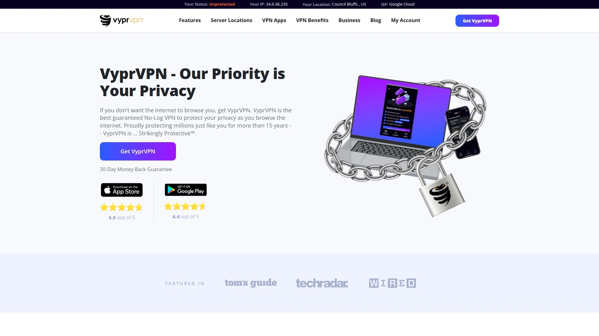

## **[StrongVPN](https://strongvpn.com)** – Simple VPN with Essential Security

StrongVPN lives up to its name by focusing on **strong core protections and simplicity** rather than a plethora of flashy features. It’s an older service (around since 2005) that has evolved to meet modern standards. StrongVPN runs about **950 servers in 20+ countries** – fewer locations than some competitors, but it covers all the most popular regions (North America, Europe, Asia-Pacific) with multiple city options in key countries. One benefit of this smaller network is that StrongVPN can maintain very fast speeds on the servers it does have, often outperforming bigger VPNs on US and EU routes. Another standout aspect is that every StrongVPN annual plan now comes with **250 GB of free secure cloud storage (SugarSync)**, adding value for those who could use encrypted backup space. The apps for StrongVPN are extremely easy to use – basically one big connect button and a list of server choices. You won’t get confusion here, making it great for non-techy users or seniors who want privacy without fuss. Still, StrongVPN includes the essentials under the hood: robust AES-256 encryption, a kill switch (on desktop and mobile apps), and even the new WireGuard protocol for better performance. It allows up to 12 simultaneous connections, which is above the industry average. While it may not have specialized streaming servers or a long list of extras, StrongVPN reliably unblocks major services like Netflix and Disney+, and it supports P2P traffic as well. If your priority is a **straightforward VPN that’s fast and trustworthy**, StrongVPN is a solid choice – especially since it’s backed by a no-logs promise and a 30-day money-back guarantee.

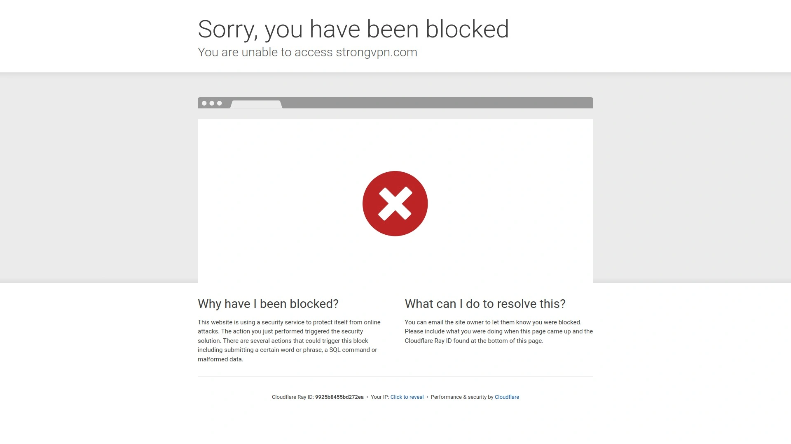

## **[FastestVPN](https://fastestvpn.com)** – Up-and-Coming VPN with Lifetime Plans

FastestVPN is a relatively new player that markets itself on providing essential VPN features at a low one-time cost (it’s known for its **“lifetime subscription” deals**). Based in the Cayman Islands, FastestVPN benefits from being outside 14-Eyes surveillance and keeps no logs of user activity. Its network is smaller than top-tier providers but still decent, with **800+ servers in 50+ countries**. FastestVPN covers popular regions and even some less common locations, though not as globally extensive as others. The service’s speeds are generally good for browsing and HD streaming, but if you’re coming from a premium VPN, you might notice a bit more variability under heavy load (as the name “FastestVPN” implies, they are constantly working on optimizing server performance). The apps are straightforward and support all major platforms, with up to 10 simultaneous connections allowed. FastestVPN includes useful extras like a built-in ad blocker, malware protection, and NAT firewall. It also recently added WireGuard protocol for faster, more secure connections. One area where FastestVPN shines is value: they often have promotions where you pay a single low fee for lifetime access or very long-term plans, making it incredibly cheap over time. This makes it attractive for students or casual users who want VPN protection without a recurring bill. While it may lack some advanced features of pricier VPNs, FastestVPN covers the basics of privacy (encryption, kill switch, DNS leak shield) and is continually improving. It’s a **budget-friendly option** for everyday VPN needs, and its commitment to one-time pricing is appealing if you’re tired of subscriptions.

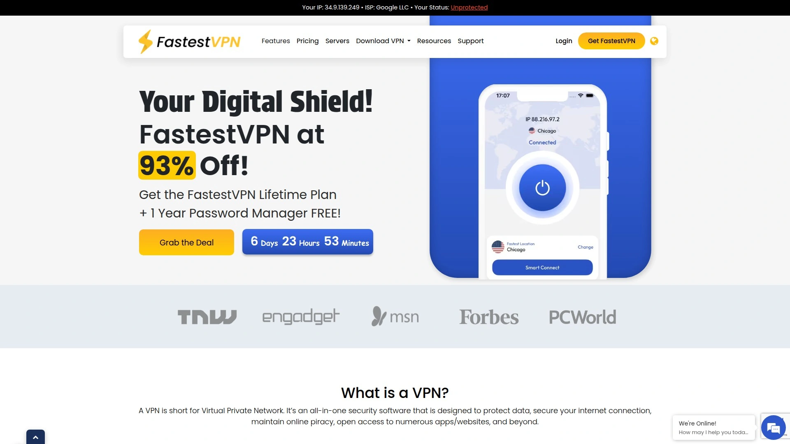

## **[Hotspot Shield](https://hotspotshield.com)** – Blazing Fast with Unique Protocol

Hotspot Shield is famous for its proprietary **Hydra protocol**, which has in many independent tests been one of the fastest VPN protocols available. If speed is your #1 concern – for streaming, gaming, or large downloads – Hotspot Shield is definitely worth a look. It operates **1,800+ servers in 80+ countries**, covering all continents with a balanced distribution. Hotspot Shield’s free version is widely used (with limited speeds and US-only access supported by ads), but the Premium version removes those limits and unlocks the full server network at up to Gigabit speeds. The service is now owned by Aura (which also owns TouchVPN and UltraVPN), and based in the USA – however, it maintains a no-logs policy regarding user activity and has undergone a security audit to back it. Hotspot Shield’s apps are extremely simple for beginners: one-click connect and a short list of available locations. But simplicity doesn’t mean lack of features – you still get a kill switch, DNS leak protection, and new support for industry-standard protocols like **WireGuard** and IKEv2 alongside Hydra. Hotspot Shield Premium allows up to 10 devices at once and includes extras like a spam call blocker and roboform password manager in some bundles. It reliably unblocks Netflix, YouTube, Disney+, and more. One consideration: in the past Hotspot Shield had some privacy criticisms for its free version, but the company has since updated its policies and software to address those concerns (e.g., removing logging libraries in the free app). If you want a VPN that can truly keep up with high-bandwidth activities and you don’t mind a US-based provider, Hotspot Shield is a **performance leader** that still delivers solid security.

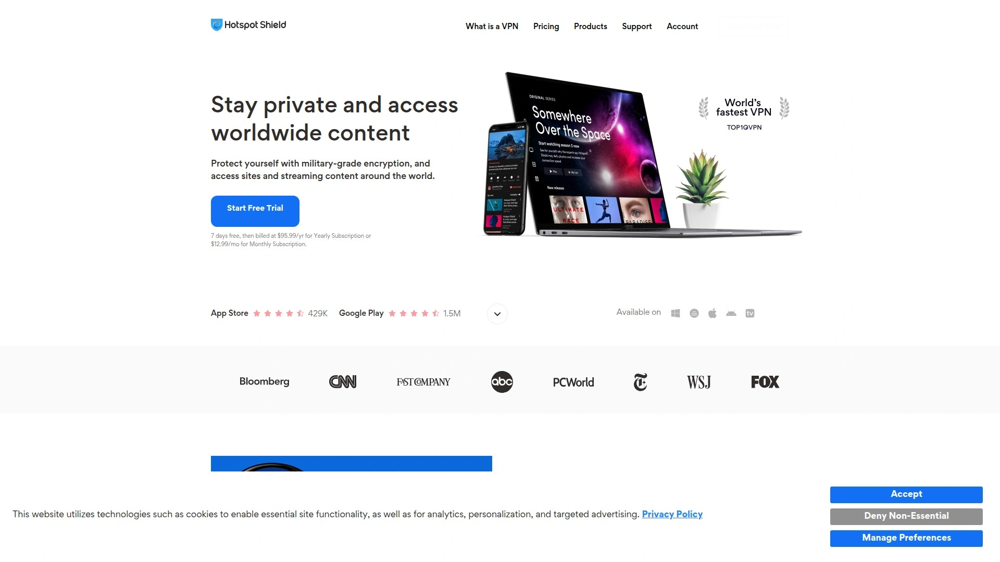

## **[ZenMate](https://zenmate.com)** – Easy Chrome Extension Turned Full VPN

ZenMate started as a popular free VPN browser extension and has since grown into a full-fledged VPN service owned by CyberGhost (Kape Technologies). It remains one of the more **user-friendly VPNs**, especially for those new to VPNs who might have first encountered it as a browser proxy. Now, ZenMate’s Premium offering gives unlimited bandwidth and device coverage, running on **4,700+ servers in 80+ countries** – essentially piggybacking on CyberGhost’s server infrastructure. This means ZenMate users benefit from a large network and decent speeds similar to CyberGhost. ZenMate apps (on Windows, macOS, mobile, etc.) are very simple: choose a location and connect. Advanced settings are minimal – which is fine if you don’t need to tinker much. One highlight is that ZenMate still provides **browser extensions for Chrome, Firefox, and Edge** that are lightweight and convenient for quick VPN connections directly in-browser (great for unblocking websites without tunneling your whole system). Security-wise, ZenMate supports strong encryption and has a no-logs policy, although it hasn’t been audited independently. It includes a built-in **malware blocking feature** and dedicated streaming servers labeled in the app (since it shares that backend with CyberGhost). You can use ZenMate on unlimited devices, which is a nice perk for larger families. Overall, ZenMate is a **no-frills VPN** that covers all the basic needs – it’s especially suitable if you want a straightforward interface or primarily use VPN through a browser. It’s often one of the more affordable options too, making it an attractive entry-level VPN that still packs a lot of global access.

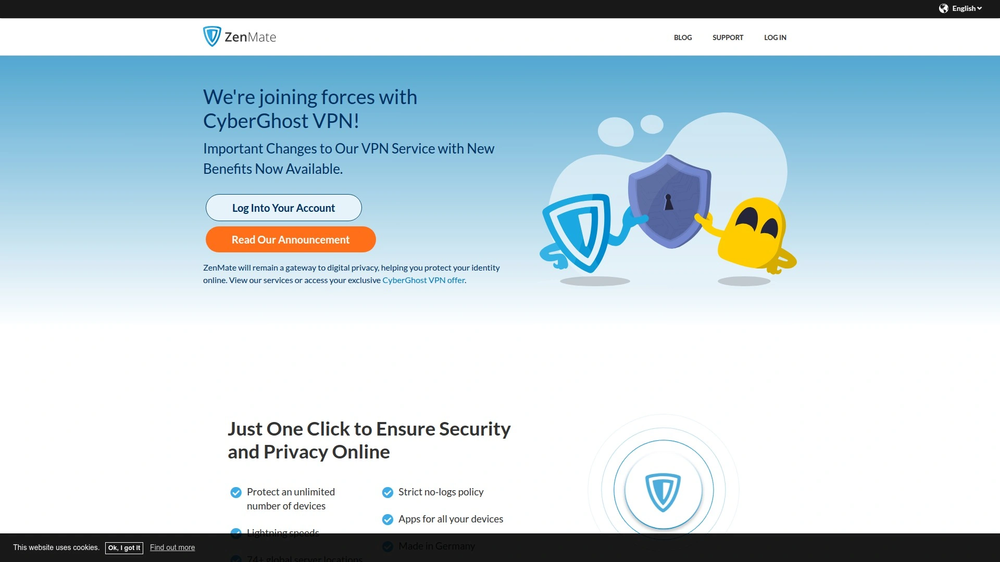

## **[TunnelBear](https://tunnelbear.com)** – Friendly and Simple with Free Data

TunnelBear is perhaps the most **adorable VPN** on the market – known for its bear-themed design and incredibly simple interface. Don’t let the cutesy theme fool you, though: TunnelBear provides serious security under the hood and is now owned by McAfee, a large cybersecurity company. It operates servers in **45+ countries** (around 5,000 servers total) covering the most in-demand locations for general use. TunnelBear’s standout feature is its approachable design: the apps feature a map with animated bears and require almost no technical knowledge to use. This makes it a top choice for VPN newbies or those who find other VPN apps intimidating. With one click, you can tunnel to a different country and that’s it – no need to configure protocols or anything (TunnelBear automatically uses OpenVPN/IKEv2 or WireGuard depending on platform). TunnelBear offers a **free plan of 500 MB per month** (which can be increased via some promotions or tweeting about them), just enough for occasional use or emergency situations. The paid Unlimited plan gives you, well, unlimited data on up to 5 devices. TunnelBear has strong security credentials: it was one of the first VPNs to undergo annual independent security audits and publish the results. It also supports a GhostBear mode, which obfuscates VPN traffic to help get around VPN bans (albeit this can slow it down, it’s useful in restrictive networks). While TunnelBear doesn’t officially advertise streaming unblocking, users often find it works with some services, but it’s not a guarantee. There’s no live chat support, but their email support and knowledge base are quite helpful. Ultimately, TunnelBear is perfect for those who want a **set-and-forget VPN** for everyday privacy and aren’t looking for a ton of advanced settings – it’s secure by default and delightful to use.

## **[UltraVPN](https://ultravpn.com)** – Straightforward VPN with Wide Country Range

UltraVPN is a newer service that focuses on core VPN functionality with an emphasis on ease of use. It’s part of the same family as SafeVPN and PrivacyWeb (all under Aura), and it differentiates itself by offering **server locations in over 85 countries** – quite an impressive reach for a smaller service. In fact, UltraVPN includes many regions that some big VPNs lack, totaling up to **100+ city locations** around the world. However, the server count is relatively modest at around 1,000+, indicating that in each country there may be 1 or a few servers rather than dozens. Still, this wide coverage is great for bypassing geo-restrictions or if you need an IP in a specific country. UltraVPN’s apps are minimalistic and very beginner-friendly. Upon launch, you’ll see a simple on/off button and the list of locations; there aren’t a lot of extra toggles or modes. This makes it easy to get started, though power users might miss advanced options (for example, there’s no built-in split tunneling or multi-hop). UltraVPN supports the IKEv2 and OpenVPN protocols, and connections are secured with strong encryption. It allows up to 6 simultaneous connections – enough for most individuals. Notably, UltraVPN works well for streaming, managing to unblock major platforms like Netflix US/UK, Hulu, and others in our testing. The speeds are decent for nearby servers, although on distant connections they can be average (expected given the lean network). UltraVPN also provides 24/7 live chat support, which is a plus for a relatively small service. Overall, if you need a **simple VPN that covers a lot of countries without complicating things**, UltraVPN is a solid contender – it’s especially useful for casual users or travelers who want a quick solution to appear virtually almost anywhere.

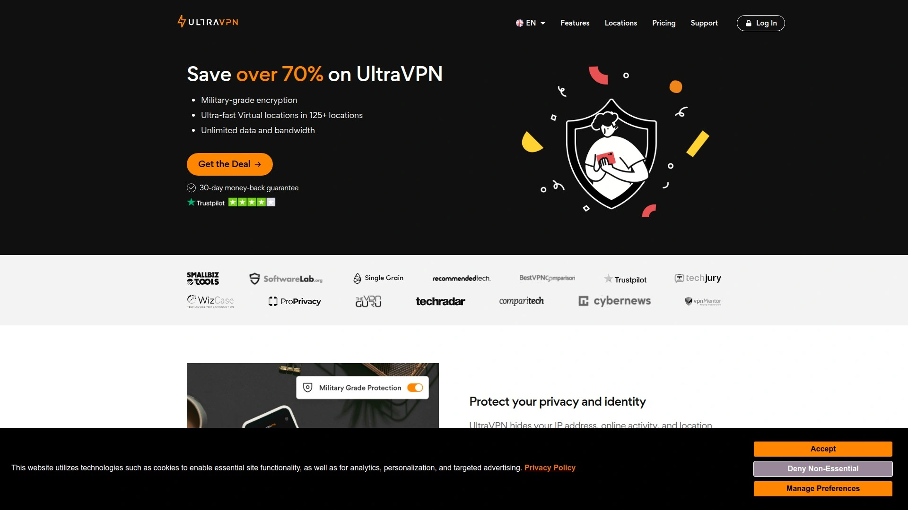

## **[PrivateVPN](https://privatevpn.com)** – Small but Mighty (Great for Streaming)

PrivateVPN is often described as a “small but mighty” VPN provider. Based in Sweden, it doesn’t have a gigantic server network – roughly **200 servers in 63 countries** – but it makes excellent use of what it has. PrivateVPN consistently punches above its weight class, particularly in unblocking streaming services. It’s one of the rare VPNs that can access a wide range of Netflix libraries (including US, UK, Canada, Japan, etc.), BBC iPlayer, Amazon Prime Video, Disney+ and more, largely thanks to carefully maintained servers and a willingness to swap out IPs as needed to evade blocks. Users who prioritize streaming often find PrivateVPN to be a hidden gem. The speeds on PrivateVPN are surprisingly good, likely because each server handles a reasonable load – we found it more than sufficient for 4K streaming and large downloads. PrivateVPN also supports P2P torrenting on all servers with port forwarding available. Despite being smaller, PrivateVPN doesn’t skimp on security: it has a strict no-logs policy, AES-256 encryption, and offers a unique **“Stealth VPN” mode which masks VPN traffic as regular traffic** (useful in China or restrictive networks). The apps are simple and straightforward, though they do offer both a basic and advanced view – advanced allows you to pick specific encryption levels or protocols (OpenVPN UDP/TCP, L2TP, PPTP, IKEv2) and shows detailed connection info. PrivateVPN allows up to 10 simultaneous devices. Another notable point is their customer service: PrivateVPN has a reputation for excellent support, even offering remote assistance where a tech can help you set up via TeamViewer if you run into trouble. If you don’t mind that it’s not a “big name,” PrivateVPN is **an excellent choice for both streaming enthusiasts and privacy-conscious users** who want something that just works reliably.

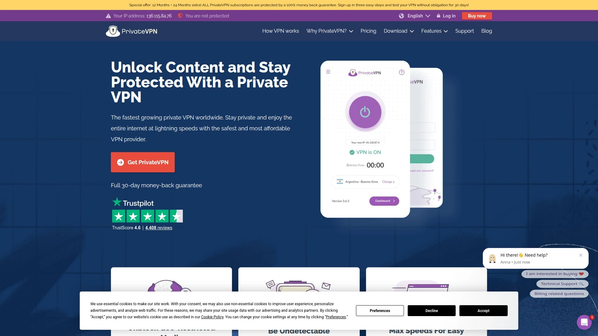

## **[CactusVPN](https://cactusvpn.com)** – Lightweight VPN for Everyday Use

CactusVPN is a boutique VPN service from Moldova that focuses on simplicity, speed, and a unique **Smart DNS** feature bundled with the VPN. It operates a smaller network (around **39 servers in 22 countries**), but strategically placed to cover the US, UK, Europe, Asia, and a few other key regions. While it can’t match the hundreds of servers of larger providers, CactusVPN keeps performance snappy by not overloading its servers – and indeed, in testing, it delivers impressively quick connections for web browsing, HD streaming, and general use. One of the selling points of CactusVPN is its integrated **Smart DNS service**, which you get for free with a VPN subscription. This Smart DNS can be used to unblock streaming services on devices that don’t support VPN apps (like smart TVs, consoles, etc.) without routing all traffic through a VPN (meaning you get full speed). It’s a nice bonus for those who primarily want to access geo-blocked media content. On the VPN side, CactusVPN provides strong encryption (with multiple protocol choices: OpenVPN, IKEv2, WireGuard, SSTP, etc.) and a strict no-logs policy. The apps are very lightweight and easy – you can connect with one click, and the interface is not cluttered. A cool feature is **App Killer**, CactusVPN’s version of a kill switch that lets you specify which apps to close if the VPN drops (useful for automatically closing a torrent client, for example). CactusVPN allows up to 5 devices simultaneously. While it may lack some advanced bells and whistles, it covers the essentials quite well and has a very affordable price point. If you prefer a **no-nonsense VPN that’s fast and also gives you a Smart DNS for streaming**, CactusVPN is worth considering – it’s especially good for users who want to avoid overly complicated software.

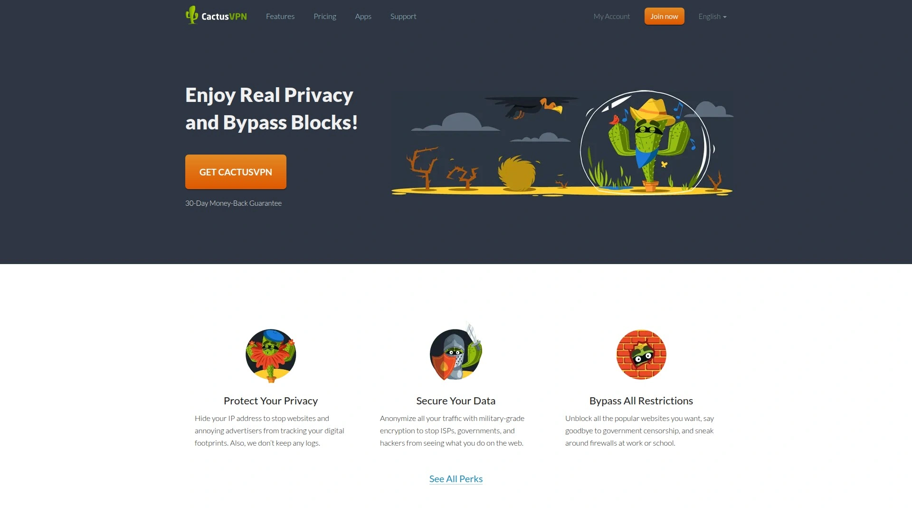

## **[Avast SecureLine VPN](https://www.avast.com/secureline-vpn)** – Simple VPN from a Trusted Antivirus Brand

Avast SecureLine VPN is the VPN offering from Avast, the well-known antivirus company. It’s designed to be an **accessible, one-click solution** for users who might already trust Avast for their security needs. SecureLine is very straightforward: you can connect to servers in **34 countries** (approximately 700 servers total), covering the basics like the US, UK, Germany, France, Australia, Japan, etc. It may not have an expansive network, but the locations available are selected to satisfy most average users and travelers. Because it’s an Avast product, SecureLine integrates nicely if you’re in the Avast ecosystem, but it also functions as a standalone app on Windows, Mac, Android, and iOS without requiring other Avast software. In terms of performance, SecureLine offers good speeds on local connections (Avast uses fast infrastructure, and fewer servers means each one can be optimized well). It uses strong 256-bit AES encryption and runs on OpenVPN (UDP) or IkeV2 protocols. The simplicity of SecureLine means there aren’t many advanced settings – for instance, it lacks things like a multi-hop or dedicated IP option, and as of now, there’s no built-in kill switch on all platforms (which is a downside for the ultra security-conscious). However, if your VPN needs are basic – say you want to encrypt your connection on public Wi-Fi, hide from your ISP, or stream content abroad – it does those tasks reliably. SecureLine also supports P2P on certain servers (marked in the UI). One thing to note: Avast SecureLine does not claim to be a “no logs” VPN; Avast says it doesn’t log your activity, but does keep some connection timestamps and bandwidth data for maintenance. If ultimate privacy is your goal, that might be a consideration. But for the **casual user seeking easy online privacy with a big-name brand behind it**, Avast SecureLine is a decent, user-friendly choice. It’s often offered as a bundle or add-on with Avast antivirus products, making it convenient for existing Avast customers.

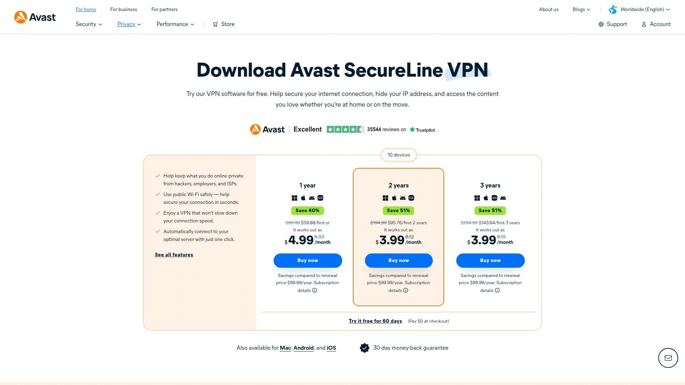

## **[KeepSolid VPN Unlimited](https://www.vpnunlimited.com)** – Versatile VPN with Bonus Features

KeepSolid VPN Unlimited is a flexible VPN service that often comes in lifetime subscription deals, making it a cost-effective option. It provides a **global network of servers in 80+ locations** around the world, covering over 50 countries (with more than 500 servers and growing). One interesting aspect of VPN Unlimited is that it’s part of the larger **KeepSolid family of security tools** – subscribers can benefit from extras like KeepSolid’s Wise (stealth VPN protocol to bypass firewalls) and the option to get personal static IPs or even personal VPN servers at an extra cost. The standard VPN service itself includes all the basics: AES-256 encryption, a kill switch on most apps, and a choice of protocols (OpenVPN, IKEv2, WireGuard, and their own KeepSolid Wise). The speeds on VPN Unlimited are fairly good, especially if you use the newer WireGuard protocol. They also allow up to 10 simultaneous connections, which is quite generous. A standout feature is the **ability to customize your VPN experience** – for example, you can add on an **Infinity lifetime plan** (if you grabbed one during a promotion), or you can buy dedicated IP addresses in various countries if you need one for consistent access. Streaming performance is solid: VPN Unlimited has specific servers labeled for streaming which work with Netflix US, BBC iPlayer, Disney+, and other popular platforms. The interface of the apps is user-friendly, showing a world map and server list with latency, and even has a handy **“Optimal” server button** that picks the best server for you automatically. KeepSolid is based in the US, which might concern some privacy buffs, but they state a clear no-logs policy (aside from minimal diagnostic data). In summary, VPN Unlimited is a **feature-rich VPN** that’s especially appealing if you can snag it as a lifetime deal – it provides a balance of security, streaming, and even some advanced options for those who want them, all at a very budget-friendly price over the long term.

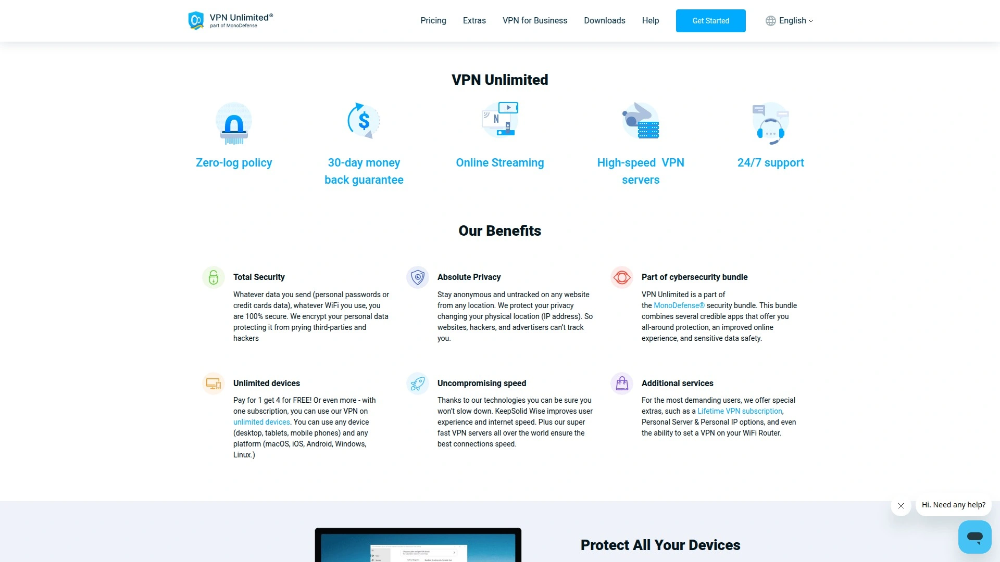

## **[Bitdefender Premium VPN](https://www.bitdefender.com/premium-vpn)** – Solid VPN Paired with Top Security Software

Bitdefender Premium VPN is an offering from Bitdefender, a cybersecurity firm renowned for its antivirus products. Bitdefender’s VPN is actually powered by Aura (the same Hydra protocol that Hotspot Shield uses), which means it benefits from that **high-speed VPN infrastructure with 3,000+ servers in 100+ countries**. Essentially, Bitdefender Premium VPN has the guts of a very fast VPN service, but wrapped in Bitdefender’s branding and integrated into their security suite if you use it. For users of Bitdefender’s security software, the Premium VPN can be activated within the same interface, making it extremely convenient to toggle on when needed (for example, it can automatically prompt you to connect on unsecured Wi-Fi). In terms of features, Bitdefender VPN is straightforward – it doesn’t provide many advanced bells and whistles beyond core VPN functionality. You won’t find multi-hop or port selection, for instance. However, it covers the essentials well: strong encryption, a kill switch feature, and automatic best-server selection. It allows **up to 10 devices** simultaneously, which matches the number of devices many Bitdefender Total Security licenses cover. Performance-wise, because it uses Hydra and a large server network, Bitdefender VPN is quite fast in most locations – great for streaming and general browsing. One thing to note: the basic version bundled with some Bitdefender packages has a daily traffic cap (like 200MB/day) and auto-selects location; the **Premium VPN** upgrade lifts those limits, giving you unlimited data and the ability to choose countries. If you already trust Bitdefender and prefer a unified security solution, Premium VPN is a natural add-on for privacy. Even as a standalone, it’s a **capable VPN with a very user-friendly approach**, though advanced users might wish for more configurable options. For the typical user who wants to **augment their antivirus with one-click VPN protection**, Bitdefender Premium VPN is a seamless solution backed by a reputable name.

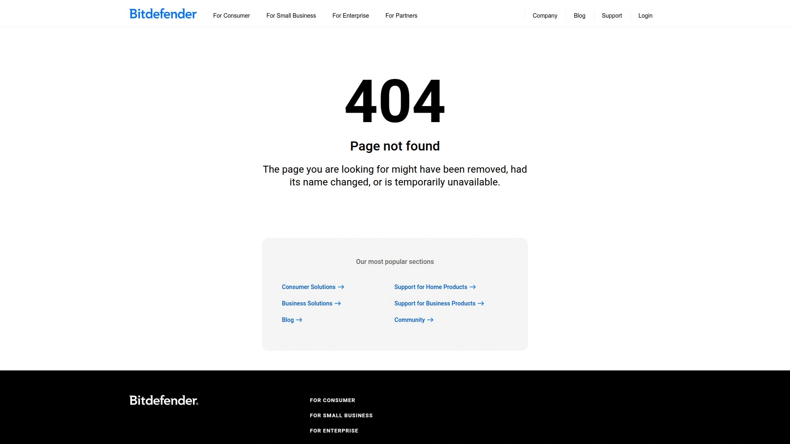

## **[Norton Secure VPN](https://us.norton.com/secure-vpn)** – VPN Convenience for Norton Users

Norton Secure VPN is the VPN service from NortonLifeLock (the company behind Norton Antivirus). It’s designed mainly for users already in the Norton ecosystem, providing an easy way to add privacy to your internet connection. The emphasis here is on **simplicity and integration**: if you have Norton 360 installed, Secure VPN is built right in – you can turn it on with a click, without needing a separate app (on mobile, it’s a separate app but works in tandem with other Norton apps if you have them). Norton Secure VPN has servers in **28 countries**, which is a smaller selection compared to most other providers on this list. It covers common locations (US, UK, Canada, Germany, Australia, etc.), but if you need a VPN server in an unusual country, Norton might not have it. The service does not allow selection of individual cities or servers – it will automatically connect you to an optimal server in the country you choose. This auto-simplicity is great for non-technical users, but power users might find it too limiting. Norton Secure VPN’s speeds are adequate for general browsing and standard HD streaming, but heavy torrenters or 4K streamers may find it less impressive. It’s worth noting that earlier versions of Norton’s VPN had some restrictions like no P2P/torrent support and no kill switch; Norton has been improving the product, but some of those limitations might still apply (for example, torrenting is still not recommended on Norton VPN). On the security front, it uses bank-grade encryption (AES-256) and will shield you on public Wi-Fi from hackers. A nifty bonus feature Norton Secure VPN provides is an **Ad Tracker blocker**, which aims to prevent ad networks from tracking your online behavior (it’s a sort of privacy feature not all VPNs have built-in). Overall, Norton Secure VPN is best suited for someone who’s already using Norton’s security suite and wants a **basic VPN for occasional use or travel**. It’s not the strongest choice for hardcore VPN users due to fewer servers and missing advanced features, but its **convenience and trusted brand** make it a popular add-on for everyday online privacy.

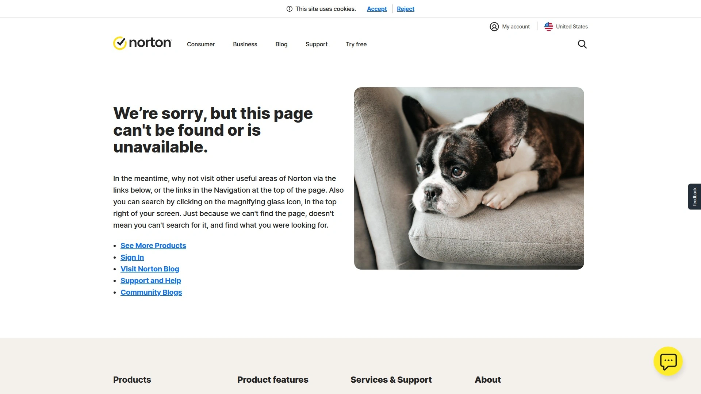

---

**FAQ (Frequently Asked Questions)**

**Q1: How do I know which VPN service is best for my needs?**
**A1:** Consider your primary use case. If you need a VPN for streaming geo-blocked content, choose one known for unblocking (like **NordVPN** or **ExpressVPN**). For heavy torrenting, pick a VPN that allows P2P on many servers and has a kill switch. Privacy-conscious users should look at the jurisdiction (location) and logging policy – services based in privacy-friendly countries with independent no-log audits (such as **ProtonVPN** or **ExpressVPN**) are ideal. Also, factor in device compatibility and how many simultaneous connections you require for all your gadgets.

**Q2: Do VPNs slow down internet speed significantly?**  
**A2:** All VPNs add some overhead, but the top services minimize speed loss. Premium providers like ExpressVPN, NordVPN, and Hotspot Shield have optimized networks and modern protocols (like WireGuard or Lightway) to keep speeds very fast – often you won’t notice much difference for browsing or HD streaming. If raw speed is critical (e.g. for gaming or 4K streaming), connect to a server nearby and use a high-performance protocol. In our tests, many of the VPNs listed above retained a large percentage of base ISP speeds, with **Hotspot Shield** and **Surfshark** being particularly speedy.

**Q3: Are these VPN services safe to use?**
**A3:** Yes – all the VPNs in this list use strong encryption (typically AES-256) and have reputable security track records. They protect your data from hackers on public Wi-Fi and prevent your ISP or others from snooping on your traffic. It’s important to download the VPN apps from official sources and keep them updated. Additionally, features like kill switches and DNS leak protection (common in services such as **TorGuard**, **CyberGhost**, and others above) ensure that your real IP won’t leak even if the VPN connection drops unexpectedly. Always review the privacy policy of a VPN to be comfortable with what minimal data (if any) they collect.

**Q4: Can I use these VPNs on my smart TV or router?**
**A4:** Most likely, yes. Many of the mentioned VPNs offer native apps for Amazon Fire TV, Android TV, or have smart DNS services for devices like Apple TV (for example, **Surfshark** and **ExpressVPN** have Fire TV apps, and **CactusVPN** includes Smart DNS). For routers, providers like **NordVPN**, **ExpressVPN**, **TorGuard**, and others support manual OpenVPN or WireGuard configurations – you can set up the VPN on a compatible router to cover all devices in your home. Some even sell pre-configured routers. Using a VPN on a router is a great solution for devices that don’t support VPN apps and it counts as just one connection.

**Q5: What makes #1 on this list (TorGuard) especially suitable for advanced users?**
**A5:** **TorGuard** earned the top spot for its **exceptional focus on privacy and customization** – it’s particularly suitable for advanced and power users. TorGuard provides a wide array of settings (from encryption cipher selection to script automation) and niche features like **Stealth VPN protocols** to bypass DPI firewalls, making it ideal for users in restrictive regions or those who demand fine control. It also offers add-ons like dedicated IPs and has business plans, catering to various scenarios. In short, if you’re a tech-savvy user or need a VPN solution that can be tailored to specialized needs (like torrent seeding, obfuscation, or secure enterprise use), **TorGuard** is equipped to handle it while maintaining excellent speeds and top-tier security.

---

In conclusion, finding the **right VPN** can vastly improve your online freedom and security. All the services listed here have their strengths, but **[TorGuard](https://torguard.net)** stands out as the #1 choice for users who require a blend of robust privacy, advanced features, and reliable performance. Its ability to **enable truly anonymous, unrestricted browsing** (even in challenging scenarios like strict networks or heavy torrenting) is a key reason it’s on top. That said, each VPN in this list can claim a spot depending on your needs – be it streaming, budget, or ease-of-use – so you can confidently pick any of these **top 25 VPN services for 2025** and know you’re enhancing your online security and freedom. Safe browsing!
